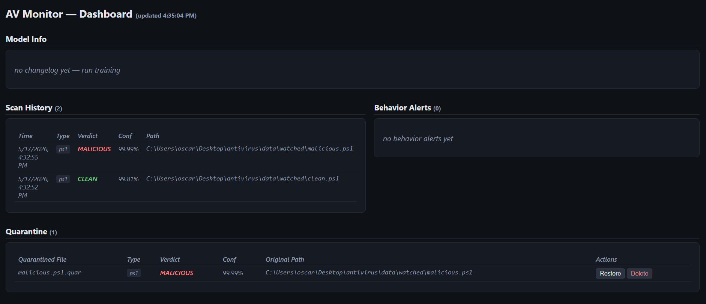

# Vigil

> Static + behavioral malware detector for Windows. Static PE analysis with LightGBM, rule-based scanning for scripts and documents, real-time filesystem and process monitoring, quarantine, and a local dashboard.


A from-scratch antivirus that scans four file types with ML/rule pipelines, watches the filesystem and process tree in real time, quarantines hits, and feeds user corrections back into a retraining loop. The PE classifier hits **97.51 % accuracy and 0.9959 AUC on the EMBER 2018 test set (200 k samples)** with a 2.07 % FPR. Everything runs natively on Windows in Python — no Docker, no driver, no kernel hooks.



## What it detects

- **PE / EXE files** — LightGBM classifier on EMBER 2018 features (2381-dim vector, byte/entropy histogram, section info, hashed imports, data directories)
- **PowerShell scripts** — LightGBM classifier on 40 hand-crafted features (obfuscation indicators, dangerous cmdlets, entropy, suspicious encodings)
- **Office macros** — `olevba` extraction + weighted rule scoring (auto-exec triggers, shell calls, downloader objects, base64/hex obfuscation)
- **PDFs** — `pdfminer` structural parse + marker regex (`/JavaScript`, `/Launch`, `/OpenAction`, FlateDecode + ASCIIHexDecode chains)
- **Behavioral patterns** — process-creation monitor flags Office → shell spawn chains, PowerShell `-EncodedCommand`, hidden-window PowerShell, and writes to the user Startup folder

## Quickstart

```powershell
git clone https://github.com/VKSFY/vigil
cd vigil
pip install -r requirements.txt

# Scan one file
python scan.py path\to\suspicious.exe

# Realtime tray + dashboard (opens http://127.0.0.1:7331/)
python -m antivirus --watch C:\path\to\downloads
```

For the full Windows install (Start Menu shortcut + autostart-on-login) run `installer\install.bat`. To train the PE pipeline you need to download EMBER 2018 first — see [How it was built → Phase 1](#phase-1--pe-classifier-on-ember).

## Detection pipelines

| File type | Method | Model | Key features |
|---|---|---|---|
| PE / EXE | ML — LightGBM binary classifier | `model.lgbm` (58 MB) | EMBER v2 2381-dim vector: byte/entropy histogram, section info, hashed imports/exports/libs, data directories, string stats |
| PowerShell | ML — LightGBM binary classifier | `ps1_model.lgbm` (764 KB) | 40 numeric features over shape, obfuscation, dangerous API counts, persistence primitives |
| Office VBA | Rules — weighted scoring | none | olevba category buckets (AutoExec / Suspicious / IOC / Base64 / Dridex) plus per-keyword bumps |
| PDF | Rules — marker regex + structural | none | `/JS`, `/JavaScript`, `/Launch`, `/OpenAction`, `/AA`, `/EmbeddedFile`, double-filter chains, object-per-page ratio |

## Results

| Pipeline | Accuracy | Precision | Recall | F1 | FPR | AUC | Eval set |
|---|---|---|---|---|---|---|---|
| **PE** | 0.9751 | 0.9791 | 0.9710 | 0.9750 | 0.0207 | 0.9959 | EMBER 2018 test, 200 k samples (50/50) |
| **PowerShell** | 1.0000 | 1.0000 | 1.0000 | 1.0000 | 0.0000 | 1.0000 | Synthetic corpus, 80/20 holdout, in-distribution |
| Office (VBA) | 2/2 | — | — | — | — | — | Rule-based; clean.bas score=20, malicious.bas score=331 vs threshold=50 |
| PDF | 2/2 | — | — | — | — | — | Rule-based; clean.pdf score=0, malicious.pdf score=200 vs threshold=35 |

The PE numbers are real EMBER eval. The PowerShell row is in-distribution on a synthetic corpus and should be read as "the pipeline is wired correctly," not "this is a production-grade detector." See [Caveats](#caveats--future-work).

## Architecture

```
                       ┌───────────────────────────────┐
                       │  python -m antivirus          │
                       │  (antivirus/__main__.py)      │
                       └─────────┬──────────────┬──────┘
                                 │              │
                       ┌─────────▼────────┐  ┌──▼──────────────┐
                       │  pystray TrayApp │  │  Flask dashboard│
                       │  (src/tray.py)   │  │  127.0.0.1:7331 │
                       └─────────┬────────┘  └─────────────────┘
                                 │
                                 ▼
                         ┌──────────────┐
                         │   Monitor    │
                         │ (monitor.py) │
                         └──┬────────┬──┘
                            │        │
            ┌───────────────▼─┐    ┌─▼─────────────────┐
            │ DirectoryWatcher│    │  ProcessMonitor   │
            │ ReadDirectoryC..│    │  psutil polling   │
            └───────┬─────────┘    └─────┬─────────────┘
                    │                    │
       ┌────────────▼──┐       ┌─────────▼──────┐
       │   Scanner     │       │ SequenceDetector│
       │ (scan_api.py) │       │ (rules engine)  │
       └──┬──┬──┬──┬───┘       └────────┬────────┘
          │  │  │  │                    │
       PE PS1 Office PDF                │
          │  │  │  │                    │
          ▼  ▼  ▼  ▼                    ▼
   ┌──────────────────────────────────────┐
   │  logs/scan_log.jsonl                 │
   │  logs/behavior_log.jsonl             │
   │  quarantine/*.quar + sidecar JSON    │
   └──────────────────────────────────────┘
                    ▲
                    │ user feedback
                    │
       python scan.py feedback <path> <label>
       python -m src.retrain --type ps1
       python -m src.update_models --manifest <file|url>
```

Full prose walkthrough in [`docs/architecture.md`](docs/architecture.md).

## How it was built

### Phase 1 — PE classifier on EMBER

The PE pipeline trains a LightGBM binary classifier on the EMBER 2018 v2 dataset (800 k samples, 2381 features per sample). The hard part wasn't the model — it was getting the *exact same feature vector* at scan time as the EMBER authors got at training time, which meant vendoring EMBER's `features.py` (LIEF 0.9-era) and patching it for LIEF 0.14 (`np.int` removal, error-class renaming, `time_date_stamp` field renaming). Setup is one-time and slow:

```powershell
curl -L -o data\ember_dataset_2018_2.tar.bz2 https://ember.elastic.co/ember_dataset_2018_2.tar.bz2
tar -xjf data\ember_dataset_2018_2.tar.bz2 -C data\
python -m src.vectorize --data-dir data\ember2018    # ~10 min, writes 9.4 GB of .dat memmaps
python -m src.train     --data-dir data\ember2018    # ~10 min on a laptop CPU
```

Training takes 600 k labeled samples through LightGBM with 500 iterations, 1024 leaves. The trained booster is 58 MB. Per-prediction inference is <2 ms.

### Phase 2 — script and document detection

The router (`src/router.py`) detects file type by magic bytes (`MZ` / `%PDF` / `PK\x03\x04` / OLE compound) with extension as tiebreaker for text formats. Each type gets its own pipeline:

- **PowerShell** uses a 40-feature numeric vector (entropy, base64 run length, IEX count, AMSI-bypass markers, persistence primitives, etc.) fed to a small LightGBM model. Trained on a deterministic synthetic corpus of 1000 scripts because no public labeled PS1 malware corpus matched the goal.
- **Office macros** go through `oletools.olevba`. The detector layers weights on top of olevba's category buckets (AutoExec gets +15 per hit, suspicious API keywords get per-keyword bumps).
- **PDFs** are scanned with a regex pass over the raw bytes (`/JavaScript`, `/Launch`, `/OpenAction`, FlateDecode + ASCIIHexDecode chained) plus a `pdfminer.six` structural parse to get page and object counts.

Each pipeline returns the same `ScanResult` dataclass — verdict, confidence, reasons, top features — so `scan.py` and the realtime monitor don't care which type they got.

### Phase 3 — realtime filesystem watcher

`src/watcher.py` uses `ReadDirectoryChangesW` with overlapped I/O so the worker thread can be cleanly cancelled — synchronous reads block indefinitely and the only "stop" is to close the directory handle, which races. A per-path debouncer collapses bursty events (a file copy fires `ADDED` then several `MODIFIED` events within milliseconds) into a single scan call 500 ms after the last event for that path. When a scan returns MALICIOUS, the file is moved into `quarantine/`, renamed with `.quar`, and a JSON sidecar captures the verdict, confidence, reasons, and top contributing features. The pystray tray app shows a green/grey shield and exposes Start/Stop/Open-Log/Exit.

### Phase 4 — behavioral process monitoring

`src/process_monitor.py` polls `psutil.pids()` cheaply (no per-process attribute resolution per poll) and fetches the full attribute set only for new PIDs. Earlier versions of the polling loop called `process_iter(["username", ...])` per cycle, which triggered `LookupAccountSid` for ~270 running processes every 150 ms — the polling thread never returned to the stop-check. The fix was splitting into "cheap diff, then snapshot only what's new."

Four behavior rules:

| Rule | Severity | Trigger |
|---|---|---|
| `OFFICE_SPAWN_SHELL` | high | `cmd / powershell / wscript / cscript / mshta / rundll32 / regsvr32` spawned by `winword / excel / powerpnt / outlook / msaccess / mspub / visio` |
| `POWERSHELL_ENCODED` | high | cmdline matches `-e[ncodedcommand]` (any prefix length) |
| `POWERSHELL_HIDDEN` | medium | cmdline matches `-w[indowstyle] hidden` |
| `STARTUP_FOLDER_WRITE` | medium | cmdline writes to `…\Microsoft\Windows\Start Menu\Programs\Startup\` |

Process-injection detection is not yet implemented — it needs ETW kernel hooks (admin) and a real ETW consumer.

### Phase 5 — feedback loop and retraining

The retrain pipeline is the part I'm most pleased with structurally. `scan.py feedback <path> <correct_label>` re-runs the scanner, captures the model's verdict + confidence + the same feature vector that drove the prediction, and appends a row to `data/feedback/feedback.jsonl`. When 50+ entries accumulate since the last retrain, scans print a `[retrain] N new feedback samples available` warning.

`python -m src.retrain --type ps1` loads the original corpus + feedback, builds an 80/20 stratified split, trains a new booster, scores BOTH the old and new booster on the *same* held-out test split (so the comparison is fair), and replaces the on-disk model **only if the new F1 strictly improves**. Either way the attempt is recorded in `models/retrain_log.jsonl` and the changelog versions are bumped — including rejected attempts, so you can see every retrain decision.

Old models go to `models/archive/ps1_model_v<N>.lgbm` and the archive keeps the last 5 versions.

### Phase 6 — distribution

`installer\install.bat` runs `pip install`, creates a Start Menu shortcut to `python -m antivirus`, and registers an HKCU\…\Run autostart key. `python -m src.update_models --manifest <path|url>` checks a JSON manifest of model SHA256 hashes against the on-disk files and atomically replaces anything that differs (verifies SHA256 after download, archives the old file). The Flask dashboard at `http://127.0.0.1:7331/` shows four panels (scan history, behavior alerts, quarantine manager with Restore/Delete, model versions and F1 scores) and auto-refreshes every 10 seconds.

## Caveats & future work

- **PowerShell metrics are in-distribution.** The 1.0 F1 reflects a synthetic generator-vs-generator-test-split. Real-world PS1 malware will score lower until the corpus is augmented with Revoke-Obfuscation-labeled samples or scripts from PowerSploit / Empire repositories. The pipeline is wired correctly; the corpus is the next thing to upgrade.
- **psutil polling misses sub-150 ms processes.** A 50 ms `cmd /c whoami` can slip through. The proper fix is ETW kernel events via `pywintrace` or a thin C extension. A WMI backend (`Win32_ProcessStartTrace`) is wired but opt-in (`--procmon-backend wmi`) because COM-from-Python in a background thread is fragile.
- **Office detection is keyword-substring-based.** `WorksheetFunction` contains both "shell" and "exec" as substrings, which triggers olevba's heuristic — so legitimate VBA can pick up a couple of false-positive hits. The score gate handles this in practice (clean fixtures sit at ~20/50) but a per-context whitelist would be cleaner.
- **PDF scanner doesn't decode stream content.** A `/JavaScript` body hidden inside a stream we don't inflate slips past. Industry tools like peepdf and pdf-parser inflate every stream; that path is the next upgrade.
- **The model auto-updater verifies SHA256 but not signatures.** Production would GPG-sign `models_manifest.json` itself and verify before trusting any SHA. Until then, only use a manifest URL you control.
- **Process-injection detection (rule #5 from the original spec)** is intentionally a placeholder — see Phase 4. ETW Microsoft-Windows-Kernel-Process events would supply `OpenProcess(PROCESS_VM_WRITE)` + `WriteProcessMemory` + `CreateRemoteThread` sequences; no polling backend can reach these.

## Tech stack

- **LightGBM 4.5** — gradient-boosted decision trees for PE and PowerShell classification
- **pefile** — human-readable PE parsing for the explanation layer
- **LIEF 0.14** — PE parsing for the EMBER-compatible feature vector
- **scikit-learn 1.5** — `FeatureHasher` for EMBER's hashed-feature buckets, evaluation metrics, train/test split
- **oletools 0.60** — OLE/OOXML compound-file parsing and VBA macro extraction (`olevba`)
- **pdfminer.six 20240706** — PDF object-graph parsing
- **pefile + LIEF combined** with vendored EMBER `features.py` for the 2381-dim vector
- **pywin32 308** — `ReadDirectoryChangesW`, overlapped I/O, registry, shortcut COM
- **psutil 6.1** — process tree polling for the behavior monitor
- **pystray 0.19 + Pillow 10.4** — tray icon with state swap (idle grey / active green)
- **Flask 3.0** — local dashboard at 127.0.0.1:7331
- **requests 2.32** — model-manifest fetching for `src/update_models.py`
- **numpy + pandas** — the usual

## FAQ

<details>
<summary><strong>Will this slow my computer down?</strong></summary>

The filesystem watcher is event-driven (`ReadDirectoryChangesW`) — it does no work until a file lands in the watched directory. Per-scan cost is ~2 ms model inference plus file I/O. The behavior monitor polls `psutil.pids()` every 300 ms by default and only fetches attributes for new PIDs (the "cheap diff" fix from Phase 4), so the polling thread sits around 0.1 % CPU on a typical 200-process system. High-churn directories (build outputs, CI workspaces) will obviously cost more — exclude them via `extra_excludes`.
</details>

<details>
<summary><strong>What happens to quarantined files — are they deleted?</strong></summary>

No. `quarantine_file()` moves the bytes into `quarantine/<sha256>.quar` and writes a sidecar JSON capturing the original path, verdict, confidence, reasons, and top features. The `.quar` extension is purely cosmetic — it's there so a stray double-click can't execute the file. Nothing is ever deleted unless you hit Delete in the dashboard's Quarantine panel.
</details>

<details>
<summary><strong>How do I know it's actually working?</strong></summary>

Three signals. The tray icon swaps from grey to green when the watcher thread is alive. The dashboard at `127.0.0.1:7331` lists the last N scans with timestamps and auto-refreshes every 10 s. And `logs/scan_log.jsonl` is appended to on every scan — `tail -f` (or `Get-Content -Wait`) it during a copy into the watched folder for a live confirmation. If the tray icon is green but no entries appear after dropping a file, check the console: `monitor.py` prints a startup warning if the `DirectoryWatcher` thread died inside `_run`.
</details>

<details>
<summary><strong>Is this a replacement for Windows Defender?</strong></summary>

No. Vigil has no kernel driver, no signed-definition update channel, no cloud lookups, and no AMSI integration. Treat it as a complementary opinion-getter — it catches a different class of things (macros, suspicious PowerShell, Office-spawn-shell behavior chains, PE files Defender's signatures haven't seen yet) and gives you a local audit trail. Run both.
</details>

<details>
<summary><strong>The dashboard shows "no changelog yet" — is something broken?</strong></summary>

No. The model-versions panel reads `models/retrain_log.jsonl`, which is written by `src/retrain.py`. Until you've run at least one retrain, the file doesn't exist and the panel renders the empty state. Run `python -m src.retrain --type ps1` once (it'll need 50+ feedback entries) and an entry will appear — even rejected retrains are logged.
</details>

<details>
<summary><strong>A file I know is safe got flagged — what do I do?</strong></summary>

Restore from the dashboard, then submit a correction:

```powershell
python scan.py feedback path\to\file.ext clean
```

This appends to `data/feedback/feedback.jsonl` with the file's feature vector and your label. Once `feedback.jsonl` has 50+ rows past the last-retrain marker, `python -m src.retrain --type ps1` will train a candidate booster and replace the model **only if F1 strictly improves** on the same held-out split. Office/PDF detections are rule-based, so feedback is recorded but doesn't auto-tune the weights — you'd edit `office_scanner.py` / `pdf_scanner.py` thresholds by hand.
</details>

<details>
<summary><strong>How do I uninstall this?</strong></summary>

Three steps:

```powershell
# 1. Remove the Run-key autostart
reg delete HKCU\Software\Microsoft\Windows\CurrentVersion\Run /v AVMonitor /f

# 2. Remove the Start Menu shortcut
del "%APPDATA%\Microsoft\Windows\Start Menu\Programs\Vigil.lnk"

# 3. Delete the repo
rmdir /s /q vigil
```

No service is installed, no registry hive is touched beyond the single Run key. The `quarantine/`, `logs/`, and `data/feedback/` folders all live inside the repo root, so removing the folder removes everything.
</details>

## License

[MIT](LICENSE) — Copyright (c) 2026 Oscar.

EMBER 2018 features are released by Endgame under their research terms; this repo doesn't redistribute the dataset, only the code that consumes it.
